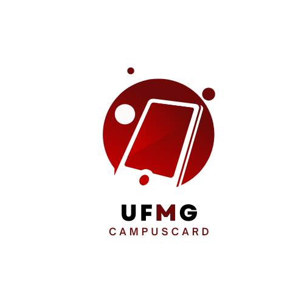

# UFMG: CAMPUScard

O Sistema Universitário Unificado: UFMG CampusCard é um aplicativo idealizado pelos autores durante o curso da disciplina de Programação e Desenvolvimento de Software II. Surgiu da ideia de facilitar o dia a dia de quem frequenta a Universidade Federal de Minas Gerais - UFMG, podendo ser utilizado por qualquer aluno interessado.

